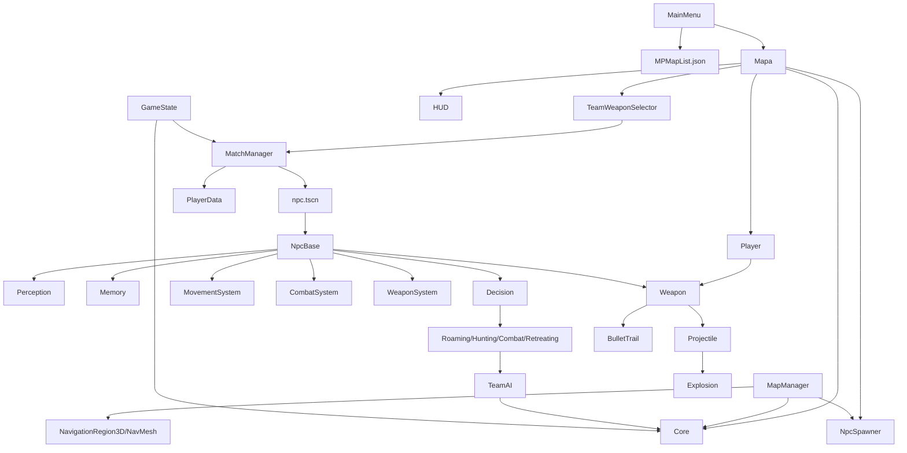
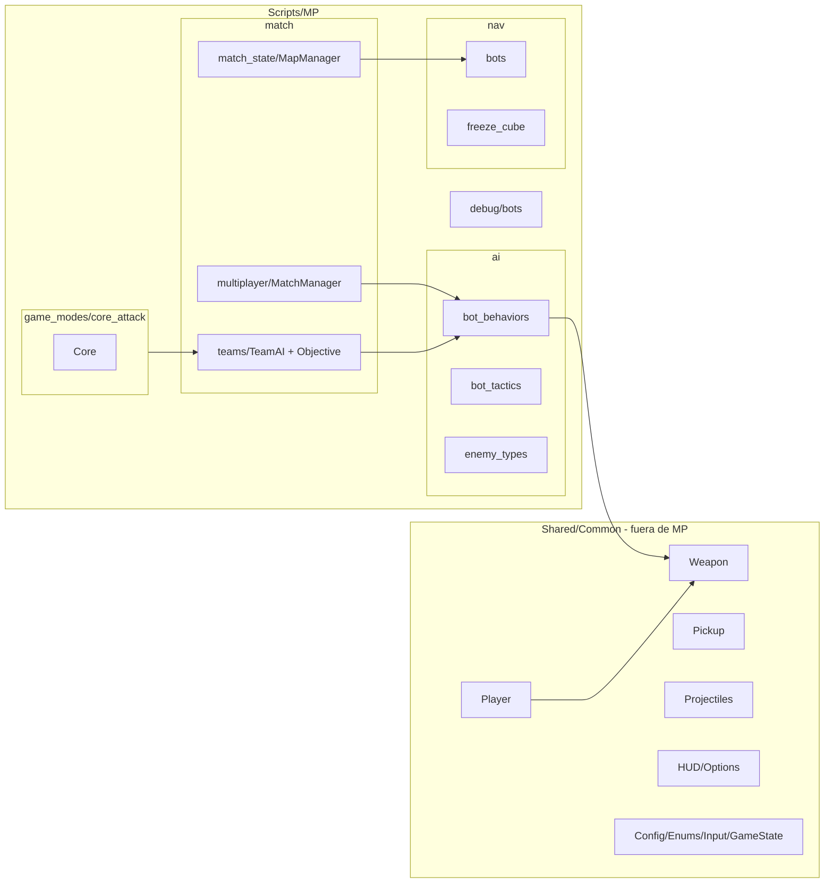

# Auditoría de scripts — Fases 1 y 2

> **Estado actual (2026-07-11):** Fase 1 de auditoría y Fase 2 de migración estructural completadas. La migración no introdujo networking ni cambios intencionales de reglas de gameplay.
>
> **Fase 2 realizada:** Bloques 1–6 completados: capitalización `scripts` → `Scripts`, navegación de bots, FSM/IA activa, FreezeCube, CoreAttack/equipos/estado de mapa y sesión/UI de partida.
>
> **Alcance original:** `res://scripts/` (82 archivos `.gd`), `project.godot`, 39 escenas `.tscn`, recursos `.tres`, JSON de configuración, autoloads, referencias serializadas, `preload/load/ResourceLoader`, señales persistidas, grupos y errores actuales del editor.
>
> **Estructura canónica posterior:** `res://Scripts/` y, para el modo local de equipos/bots, `res://Scripts/MP/`.

## 1. Compatibilidad y límites de esta auditoría

### Versión detectada

- **Declarada por `project.godot`:** Godot **4.7**, renderer **Forward Plus** (`config/features=PackedStringArray("4.7", "Forward Plus")`).
- **Editor/proyecto abierto:** Godot **4.7-stable (Steam)**.
- **Física 3D configurada:** **Jolt Physics**.
- **Plataforma de auditoría:** Windows x64, D3D12.

Todo cambio posterior debe usar sintaxis y APIs de **Godot 4.x**, conservar rutas `res://` y validar en plataformas sensibles a mayúsculas/minúsculas.

### Método y limitaciones

La auditoría combinó análisis de referencias estáticas y estructura de escenas. No existe un perfil capturado ni una ejecución limpia de partida durante esta fase, por lo que ningún patrón se declara cuello de botella confirmado. La ausencia de referencias estáticas **no prueba** que un archivo esté muerto: `class_name`, recursos externos, instanciación dinámica, grupos, escenas externas y datos de usuario pueden usarlo indirectamente.

En Fase 1, Windows resolvía `res://scripts` y `res://Scripts` al mismo directorio físico; era un riesgo real de exportación case-sensitive. En Fase 2 se hizo el rename intermedio `scripts → __scripts_case_tmp → Scripts` y las rutas activas se normalizaron a **`res://Scripts/...`**. Falta comprobar el resultado en export o checkout Linux/macOS, porque Windows sigue siendo case-insensitive.

## 2. Resumen arquitectónico

### Flujo operativo observado

```text
main_menu.tscn / MainMenu
  -> config/maps/MPMapList.json
  -> escena de mapa
     -> Player + HUD + TeamWeaponSelector
     -> MapManager (autoload): cores, spawners, NavMesh, puntos semánticos
     -> TeamWeaponSelector.iniciar_partida()
        -> MatchManager (autoload)
           -> pool de res://scenes/npcs/npc.tscn
              -> NpcBase
                 -> Perception / Memory / Navigation / Movement
                 -> DecisionSystem + StateRoaming/Hunting/Combat/Retreating
                 -> CombatSystem / WeaponSystem
```

### Autoloads activos

| Autoload | Ruta actual | Papel |
|---|---|---|
| `ConfigManager` | `res://Scripts/config_manager.gd` | Configuración de armas y salud. |
| `GameState` | `res://Scripts/game_state.gd` | Estado persistente, equipo, cores y resultado. |
| `TeamAI` | `res://Scripts/MP/match/teams/team_ai.gd` | Objetivos y órdenes de equipo. |
| `InputManager` | `res://Scripts/input_manager.gd` | InputMap/rebinding. |
| `MapManager` | `res://Scripts/MP/match/match_state/map_manager.gd` | Inicialización de mapa, navmesh, cores y spawners. |
| `MatchManager` | `res://Scripts/MP/match/multiplayer/match_manager.gd` | Sesión, bots, respawn, equipos y PlayerData. |
| `PickupManager` | `res://Scripts/pickup_manager.gd` | Registro y búsqueda de pickups. |

`project.godot` contiene además una entrada global no seccionada `autoload="MatchManager=..."` y la entrada canónica bajo `[autoload]`. No se modifica en Fase 1; debe verificarse desde Project Settings antes de limpiar la clave residual.

### Estado real de multiplayer

No se encontraron `@rpc`, `rpc()`, `MultiplayerPeer`, `ENetMultiplayerPeer`, `set_multiplayer_authority`, `MultiplayerSynchronizer` ni configuración de red. El prefijo **MP** representa actualmente un modo local de equipos y bots, no netcode multijugador de red. Cualquier fase futura de red requerirá un diseño específico de autoridad, replicación, anti-cheat, predicción, reconciliación y sincronización; no debe inferirse desde esta arquitectura local.

## 3. Árbol resumido actual

```text
res://Scripts/
├── MP/
│   ├── ai/bot_behaviors/            # FSM activa, percepción, memoria, combate y armas
│   ├── ai/bot_tactics/              # TacticalRole
│   ├── nav/bots/                    # movimiento, NavigationSystem y puntos semánticos
│   ├── nav/freeze_cube/             # FreezeCube, cubos y controladores de salto
│   ├── game_modes/core_attack/      # Core
│   └── match/
│       ├── teams/                   # TeamAI y Objective
│       ├── multiplayer/             # MatchManager, PlayerData, Spawner, UI de match
│       └── match_state/             # MapManager
├── ai/behaviors/                    # pipeline BotBrain legacy
├── ai/weapon_ai_profile.gd          # compartido, deliberadamente fuera de MP
├── effects/, maps/, projectiles/, props/
└── [gameplay/UI/shared y wrappers legacy]
```

La estructura solicitada `res://Scripts/MP/` es ahora canónica. La verificación de export/check-out case-sensitive queda pendiente.

## 4. Criterio de clasificación y conteos

Cada archivo tiene una **clasificación principal exclusiva** para que el inventario sume 82. Las etiquetas `REF` (refactor), `OPT` (optimización) y `ELIM` (candidato a eliminación) son riesgos secundarios y pueden coexistir con la categoría principal.

| Clasificación principal | Cantidad | Interpretación |
|---|---:|---|
| ESENCIAL | 6 | Base global/autoload o entrada indispensable. |
| COMPARTIDO | 17 | Gameplay/UI/recursos usados por humano y/o bots; no mover a MP. |
| MULTIPLAYER | 9 | Exclusivo del modo actual de equipos/partida, no de red. |
| BOT | 25 | Exclusivo de bots del modo actual. |
| CANDIDATO_A_REFACTOR | 1 | Herramienta de test desalineada que debe corregirse o retirarse. |
| CANDIDATO_A_OPTIMIZACION | 0 | Ninguno como categoría primaria; hay 13 etiquetas `OPT` secundarias. |
| CANDIDATO_A_ELIMINACION | 21 | Nunca borrar sin pruebas y aprobación posterior. |
| NO_CONCLUYENTE | 3 | Evidencia insuficiente para una decisión segura. |
| **Total** | **82** | |

Etiquetas no exclusivas destacadas: `REF` en MatchManager, MapManager, NpcBase, MovementSystem, CombatSystem, StateRoaming, Weapon y varios cubos; `OPT` en IA, navegación, VFX, proyectiles, HUD/scoreboard y debug.

## 5. Inventario completo

**Leyenda de riesgo:** B=bajo, M=medio, A=alto. `—` en destino significa que debe mantenerse fuera de MP. Las rutas de destino son **propuestas de Fase 2**, no cambios efectuados.

### 5.1 Implementaciones actuales de bots y mecánicas de mapa

| Ruta actual | Clase / herencia | Responsabilidad, dependencias y consumidor conocido | Principal / etiquetas | MP, destino propuesto, riesgo |
|---|---|---|---|---|
| `scripts/MP/Bots/npc_base.gd` | `NpcBase : CharacterBody3D` | Orquestador bot; crea 6 subsistemas IA, equipa Weapon, busca cores/pickups, freeze, respawn y overlay. Escenas `npc.tscn`, `npc_base.tscn`; MatchManager instancia `npc.tscn`. | BOT; REF, OPT | Sí → `Scripts/MP/ai/bot_behaviors/npc_base.gd`; A. |
| `scripts/MP/Bots/tactical_role.gd` | `TacticalRole : RefCounted` | Perfil táctico usado por NpcBase, estados, percepción y TeamAI. Depende de Enums/RouteDiversifier. | BOT; REF | Sí → `Scripts/MP/ai/bot_tactics/tactical_role.gd`; M. |
| `scripts/MP/Bots/freeze_cube.gd` | `FreezeCube : Area3D` | Trigger de freeze sobre `NpcBase`; escena `Puntossem/freeze_cube.tscn`, mapas 3 y Guerra. | BOT; REF | Sí → `Scripts/MP/nav/freeze_cube/freeze_cube.gd`; M. |
| `scripts/MP/Bots/freeze_cube0.gd` | `FreezeCube0 : Area3D` | Trigger por rol que crea `RoleJumpController`; escena `freeze_cube0.tscn`. | BOT; REF | Sí → `Scripts/MP/nav/freeze_cube/freeze_cube_role.gd`; M. |
| `scripts/MP/Bots/freeze_cube2.gd` | `FreezeCube2 : Area3D` | Trigger hacia YellowCube mediante `YellowJumpController`; escena `freeze_cube2.tscn`. | BOT; REF | Sí → `Scripts/MP/nav/freeze_cube/freeze_cube_yellow.gd`; M. |
| `scripts/MP/Bots/role_jump_controller.gd` | `RoleJumpController : Node` | Trayectoria parabólica pos-FreezeCube0; acopla a `State_Roaming`. | BOT; REF | Sí → `Scripts/MP/nav/freeze_cube/role_jump_controller.gd`; M. |
| `scripts/MP/Bots/yellow_jump_controller.gd` | `YellowJumpController : Node` | Trayectoria parabólica pos-FreezeCube2 y descongelación. | BOT; REF | Sí → `Scripts/MP/nav/freeze_cube/yellow_jump_controller.gd`; M. |
| `scripts/green_cube.gd` | `GreenCube : Node3D` | Registra grupo `green_cube`; NpcBase busca el más cercano durante freeze. Escena `green_cube.tscn`. | BOT | Sí → `Scripts/MP/nav/freeze_cube/green_cube.gd`; B. |
| `scripts/yellow_cube.gd` | `YellowCube : Node3D` | Registra grupo `yellow_cube`; NpcBase/FreezeCube2 lo consumen. Escena `yellow_cube.tscn`. | BOT | Sí → `Scripts/MP/nav/freeze_cube/yellow_cube.gd`; B. |

### 5.2 IA actual de bots

| Ruta actual | Clase / herencia | Responsabilidad, dependencias y consumidor conocido | Principal / etiquetas | MP, destino propuesto, riesgo |
|---|---|---|---|---|
| `scripts/ai/bot_state.gd` | `BotState : Node` | Base FSM; expone referencias a NpcBase, comandos, percepción, memoria y navegación. Estados actuales la heredan. | BOT | Sí → `Scripts/MP/ai/bot_behaviors/bot_state.gd`; M. |
| `scripts/ai/decision_system.gd` | `DecisionSystem : Node` | FSM actual; posee estado, objetivo y comandos. NpcBase la crea y registra estados dinámicamente. | BOT; REF | Sí → `Scripts/MP/ai/bot_behaviors/decision_system.gd`; A. |
| `scripts/ai/combat_command.gd` | `CombatCommand : RefCounted` | DTO transitorio de intención de combate para Decision/Combat. | BOT | Sí → `Scripts/MP/ai/bot_behaviors/combat_command.gd`; B. |
| `scripts/ai/movement_command.gd` | `MovementCommand : RefCounted` | DTO transitorio de navegación, directo, dodge, hold y salto. | BOT | Sí → `Scripts/MP/nav/bots/movement_command.gd`; B. |
| `scripts/ai/perception_system.gd` | `PerceptionSystem : Node` | AreaVision + doble LOS, scoring y señales. NpcBase lo llama cada tick físico. | BOT; OPT | Sí → `Scripts/MP/ai/bot_behaviors/perception_system.gd`; A. |
| `scripts/ai/memory_system.gd` | `MemorySystem : Node` | Memoria temporal de enemigos/objetivos/pickups. Consumido por FSM y Perception. | BOT; OPT | Sí → `Scripts/MP/ai/bot_behaviors/memory_system.gd`; M. |
| `scripts/ai/combat_system.gd` | `CombatSystem : Node` | Aim, fire, lead prediction, dodge y daño del bot. Dependencias Decision, WeaponSystem y Weapon. | BOT; REF, OPT | Sí → `Scripts/MP/ai/bot_behaviors/combat_system.gd`; A. |
| `scripts/ai/weapon_system.gd` | `WeaponSystem : Node` | Registro, selección y recarga de armas bot; lee perfiles `.tres`. | BOT; REF | Sí → `Scripts/MP/ai/bot_behaviors/weapon_system.gd`; M. |
| `scripts/ai/movement_system.gd` | `MovementSystem : Node` | Único escritor previsto de velocity: NavigationAgent, RVO, step-up/down, vault y anti-stuck. | BOT; REF, OPT | Sí → `Scripts/MP/nav/bots/movement_system.gd`; A. |
| `scripts/ai/navigation/navigation_system.gd` | `NavigationSystem : Node` | Agent y caché global de `SemanticPointMarker`. Consumido por NpcBase/StateRoaming. | BOT; OPT | Sí → `Scripts/MP/nav/bots/navigation_system.gd`; M. |
| `scripts/ai/navigation/semantic_point.gd` | `SemanticPoint : RefCounted` | DTO de ruta táctica/posición/equipo. | BOT | Sí → `Scripts/MP/nav/bots/semantic_point.gd`; B. |
| `scripts/ai/navigation/semantic_point_marker.gd` | `SemanticPointMarker : Marker3D` | Marcador de editor; grupo `semantic_points`; escenas `Puntossem/*point.tscn`. | BOT | Sí → `Scripts/MP/nav/bots/semantic_point_marker.gd`; M. |
| `scripts/ai/states/state_roaming.gd` | `StateRoaming : BotState` | Órdenes, puntos semánticos, pickups, core y wander. Cargado dinámicamente por NpcBase. | BOT; REF, OPT | Sí → `Scripts/MP/ai/bot_behaviors/state_roaming.gd`; A. |
| `scripts/ai/states/state_hunting.gd` | `StateHunting : BotState` | Navega a última posición recordada. Carga dinámica. | BOT | Sí → `Scripts/MP/ai/bot_behaviors/state_hunting.gd`; M. |
| `scripts/ai/states/state_combat.gd` | `StateCombat : BotState` | Chase/strafe/core/retirada durante combate. Carga dinámica. | BOT; REF, OPT | Sí → `Scripts/MP/ai/bot_behaviors/state_combat.gd`; A. |
| `scripts/ai/states/state_retreating.gd` | `StateRetreating : BotState` | Retirada al core aliado con vida crítica. Carga dinámica. | BOT | Sí → `Scripts/MP/ai/bot_behaviors/state_retreating.gd`; M. |

### 5.3 Modo de partida/equipos/CoreAttack

| Ruta actual | Clase / herencia | Responsabilidad, dependencias y consumidor conocido | Principal / etiquetas | MP, destino propuesto, riesgo |
|---|---|---|---|---|
| `scripts/match_manager.gd` | `Node` (autoload) | Pool de bots, respawn, equipos, auto-balance y PlayerData. Consumido por HUD, Player, selector, bots y menú debug. | MULTIPLAYER; REF, OPT | Sí → `Scripts/MP/match/multiplayer/match_manager.gd`; A. |
| `scripts/map_manager.gd` | `Node` (autoload) | Descubre mapa, configura cores/spawners, hornea navmesh e intenta cargar puntos semánticos. | MULTIPLAYER; REF, OPT | Sí → `Scripts/MP/match/match_state/map_manager.gd`; A. |
| `scripts/team_ai.gd` | `Node` (autoload) | Objetivos, score y órdenes de equipo. Dependencias Core/GameState/NpcBase/grupo npc. | MULTIPLAYER; REF | Sí → `Scripts/MP/match/teams/team_ai.gd`; A. |
| `scripts/player_data.gd` | `PlayerData : RefCounted` | DTO de MatchManager/scoreboard, humano/bot/equipo/vida/kills. | MULTIPLAYER | Sí → `Scripts/MP/match/multiplayer/player_data.gd`; B. |
| `scripts/spawner.gd` | `NpcSpawner : Node3D` | Recoge Marker3D hijos y registra spawns en MatchManager; adjunto a mapas. | MULTIPLAYER | Sí → `Scripts/MP/match/multiplayer/spawner.gd`; M. |
| `scripts/core.gd` | `Core : StaticBody3D` | Objetivo destruible, condición de victoria y estado de equipos. Escena `objectives/core.tscn`. | MULTIPLAYER | Sí → `Scripts/MP/game_modes/core_attack/core.gd`; A. |
| `scripts/ai/objective.gd` | `Objective : Resource` | Recurso de objetivo táctico de TeamAI. | MULTIPLAYER | Sí → `Scripts/MP/match/teams/objective.gd`; B. |
| `scripts/scoreboard.gd` | `Scoreboard : Control` | Presenta `MatchManager.get_all_players_data()`. Instanciado por HUD. | MULTIPLAYER; OPT | Sí → `Scripts/MP/match/multiplayer/scoreboard.gd`; M. |
| `scripts/team_weapon_selector.gd` | `CanvasLayer` | Selección de equipo/arma e inicio de partida. Instanciado por mapas. | MULTIPLAYER | Sí → `Scripts/MP/match/multiplayer/team_weapon_selector.gd`; M. |

### 5.4 Fundaciones esenciales y gameplay compartido — no mover a MP

| Ruta actual | Clase / herencia | Responsabilidad, dependencias y consumidor conocido | Principal / etiquetas | MP, destino propuesto, riesgo |
|---|---|---|---|---|
| `scripts/config_manager.gd` | `Node` (autoload) | Lee `config/skill.json`; salud y armas para Player/NpcBase/Weapon. | ESENCIAL | No; configuración compartida; M. |
| `scripts/enums.gd` | `Enums : Node` | Equipos, roles, experiencia y estados usados transversalmente. | ESENCIAL | No; contrato global; B. |
| `scripts/game_state.gd` | `GameStateClass : Node` (autoload) | Estado de partida y también ajustes persistentes de usuario. | ESENCIAL | No sin separar estado de sesión de preferencias; A. |
| `scripts/input_manager.gd` | `Node` (autoload) | Rebinding y acciones creadas en runtime; OptionsMenu lo usa. | ESENCIAL | No; input compartido; M. |
| `scripts/main_menu.gd` | `Control` | Lee `MPMapList.json` y cambia al mapa elegido. Escena principal. | ESENCIAL | No; UI/entrada general; M. |
| `scripts/pickup_manager.gd` | `Node` (autoload) | Registro/búsqueda lineal de pickups, usada por Pickup/NpcBase. | ESENCIAL | No; pickup reutilizable; M. |
| `scripts/player.gd` | `Player : CharacterBody3D` | Control humano, movimiento, armas, daño, respawn, vault y pickups. `player.tscn`. | COMPARTIDO; OPT | No; humano y posible SP/MP; A. |
| `scripts/weapon.gd` | `Weapon : Node3D` | Hitscan, proyectiles, melee, daño, recarga, VFX y perfiles IA. Usada por Player/NpcBase. | COMPARTIDO; REF, OPT | No; reglas de arma compartidas; A. |
| `scripts/ai/weapon_ai_profile.gd` | `WeaponAIProfile : Resource` | Perfil reutilizable de arma bot; 24 recursos en `config/ai_profiles`. | COMPARTIDO | No; dato de arma/IA reutilizable; B. |
| `scripts/pickup.gd` | `Pickup : RigidBody3D` | Base física/detección/despawn de pickups. | COMPARTIDO | No; M. |
| `scripts/weapon_pickup.gd` | `WeaponPickup : Pickup` | Arma caída usada realmente por `pickups/dropped_weapon.tscn`. | COMPARTIDO | No; M. |
| `scripts/resupply_box.gd` | `ResupplyBox : Area3D` | Reabastece Player. Escena `resupply_box.tscn`. | COMPARTIDO | No; B. |
| `scripts/vault_controller.gd` | `VaultController : RefCounted` | Vault usado por Player y MovementSystem. | COMPARTIDO; OPT | No; explícitamente compartido; M. |
| `scripts/projectiles/projectile_base.gd` | `ProjectileBase : RigidBody3D` | Proyectil, impacto, explosión y lifespan. | COMPARTIDO; OPT | No; M/A con spam. |
| `scripts/projectiles/projectile_explosive.gd` | `ProjectileExplosive : ProjectileBase` | Variante explosiva; sin instanciación estática hallada. | COMPARTIDO | No; no mover; M. |
| `scripts/projectiles/projectile_plasma.gd` | `ProjectilePlasma : ProjectileBase` | Variante plasma; sin escena/selector estático hallado. | COMPARTIDO; OPT | No; M. |
| `scripts/projectiles/projectile_sticky.gd` | `ProjectileSticky : ProjectileBase` | Variante sticky; sin escena/selector estático hallado. | COMPARTIDO | No; M. |
| `scripts/effects/bullet_trail.gd` | `BulletTrail : Node3D` | VFX temporal instanciado por Weapon. | COMPARTIDO; OPT | No; M. |
| `scripts/effects/explosion.gd` | `Explosion : Area3D` | Daño radial y VFX temporal, instanciado por ProjectileBase. | COMPARTIDO; OPT | No; M. |
| `scripts/props/prop_base.gd` | `PropBase : StaticBody3D` | Base de props de construcción/rampas/escaleras. | COMPARTIDO | No; B. |
| `scripts/hud.gd` | `CanvasLayer` | HUD humano: pausa, muerte, core bars, prompts, scoreboard y balance. | COMPARTIDO; REF | No sin separar HUD local de HUD de match; M/A. |
| `scripts/options_menu.gd` | `OptionsMenu : Control` | Audio/vídeo/rebinding y cambio de equipo. | COMPARTIDO; REF | No; UI híbrida; M. |
| `scripts/bot_debug_overlay.gd` | `BotDebugOverlay : Node3D` | Overlay 3D de Player/NpcBase, escena `bot_debug_overlay.tscn`. | COMPARTIDO; OPT | No por ahora: sirve a humano y bots. Si se separa, destino `Scripts/MP/debug/bots/`; M. |

### 5.5 Pipeline legacy, wrappers, herramientas y estados inciertos

| Ruta actual | Clase / herencia | Evidencia revisada | Principal / etiquetas | Decisión segura y riesgo |
|---|---|---|---|---|
| `scripts/ai/bot_behavior.gd` | `BotBehavior : RefCounted` | Base de behaviors; solo BotBrain/4 behaviors. NpcBase actual usa FSM. | CANDIDATO_A_ELIMINACION | Retirar solo junto al pipeline completo; M. |
| `scripts/ai/bot_brain.gd` | `BotBrain : Node` | No hay `BotBrain.new()`/escena; usa APIs obsoletas de NpcBase/Navigation. | CANDIDATO_A_ELIMINACION; REF | Verificar runtime y recursos externos antes de retirar; A. |
| `scripts/ai/decision_context.gd` | `DecisionContext : RefCounted` | Blackboard exclusivo de BotBrain/behaviors, no de FSM. | CANDIDATO_A_ELIMINACION | Retirar junto a BotBrain; M. |
| `scripts/ai/behaviors/behavior_combat.gd` | `BehaviorCombat : BotBehavior` | Pipeline legacy; llama miembros obsoletos. | CANDIDATO_A_ELIMINACION | No borrar aislado; A. |
| `scripts/ai/behaviors/behavior_hunt.gd` | `BehaviorHunt : BotBehavior` | Solo carga dinámica desde BotBrain; no ruta actual. | CANDIDATO_A_ELIMINACION | No borrar aislado; M/A. |
| `scripts/ai/behaviors/behavior_idle.gd` | `BehaviorIdle : BotBehavior` | Fallback legacy de BotBrain. | CANDIDATO_A_ELIMINACION | No borrar aislado; M. |
| `scripts/ai/behaviors/behavior_patrol.gd` | `BehaviorPatrol : BotBehavior` | Duplica conceptualmente StateRoaming; solo BotBrain. | CANDIDATO_A_ELIMINACION | No borrar aislado; M/A. |
| `scripts/dropped_weapon.gd` | `DroppedWeapon : RigidBody3D` | Implementación alternativa; la escena real usa WeaponPickup y no se halló consumidor estático. | CANDIDATO_A_ELIMINACION | Comparar uso manual/externo antes de retirar; M. |
| `scripts/iaskill.gd` | `IaSkill : NpcBase` | Miembros esperados no existen en NpcBase actual; sin instancia hallada. | CANDIDATO_A_ELIMINACION | Prueba de carga/búsqueda de recursos primero; A. |
| `scripts/maps/map_1_semantic_points.gd` | `MapSemanticPoints : Node` | No lo carga MapManager; escribe propiedades que no están en SemanticPoint actual. | CANDIDATO_A_ELIMINACION | Migrar datos a Marker3D o retirar con evidencia; A. |
| `scripts/check_nav.gd` | `SceneTree` | Herramienta manual de consola, no gameplay. | CANDIDATO_A_ELIMINACION | Mover a tests o retirar con aprobación; B. |
| `scripts/npc_melee.gd` | sin clase/extends | Archivo deprecado pero adjunto a `npc_melee.tscn`. | CANDIDATO_A_ELIMINACION | Primero corregir/retirar escena heredada; M. |
| `scripts/npc_pistolero.gd` | sin clase/extends | Archivo deprecado pero adjunto a `npc_pistolero.tscn`. | CANDIDATO_A_ELIMINACION | Primero corregir/retirar escena heredada; M. |
| `scripts/npc_escopetero.gd` | sin clase/extends | Archivo deprecado pero adjunto a `npc_escopetero.tscn`. | CANDIDATO_A_ELIMINACION | Primero corregir/retirar escena heredada; M. |
| `scripts/npc_base.gd` | wrapper `extends MP/Bots/npc_base.gd` | Sin escena/referencia activa encontrada; ruta de compatibilidad potencial. | CANDIDATO_A_ELIMINACION | Mantener hasta barrido completo y export test; M. |
| `scripts/freeze_cube.gd` | wrapper | Redirige a `MP/Bots/freeze_cube.gd`; escenas usan implementación MP directa. | CANDIDATO_A_ELIMINACION | Mantener temporalmente; B/M. |
| `scripts/freeze_cube0.gd` | wrapper | Igual, variante role. | CANDIDATO_A_ELIMINACION | Mantener temporalmente; B/M. |
| `scripts/freeze_cube2.gd` | wrapper | Igual, variante yellow. | CANDIDATO_A_ELIMINACION | Mantener temporalmente; B/M. |
| `scripts/role_jump_controller.gd` | wrapper | Redirige a MP/Bots. | CANDIDATO_A_ELIMINACION | Mantener temporalmente; B/M. |
| `scripts/tactical_role.gd` | wrapper | Redirige a MP/Bots. | CANDIDATO_A_ELIMINACION | Mantener temporalmente; B/M. |
| `scripts/yellow_jump_controller.gd` | wrapper | Redirige a MP/Bots. | CANDIDATO_A_ELIMINACION | Mantener temporalmente; B/M. |
| `scripts/test_stuck_detection.gd` | `SceneTree` | Test manual consulta constantes/API desalineadas de la implementación actual. | CANDIDATO_A_REFACTOR | Corregir como test real o retirar; M/A. |
| `scripts/_unused_route_diversifier.gd` | `RouteDiversifier` | Nombre/documentación indican desuso, pero TacticalRole expone dependencia de enum. | NO_CONCLUYENTE | No borrar sin retirar también el contrato de TacticalRole; M. |
| `scripts/dev_menu.gd` | `Control` | Herramientas de spawn, equipo, invisibilidad, órdenes y overlay; está incluido en HUD. | NO_CONCLUYENTE; REF, OPT | Decidir separación dev/release, no mover a MP aún; M. |
| `scripts/enemy_pistolero.gd` | `EnemyPistolero : EnemyBase` | `EnemyBase` no existe; no se encontró instancia. | NO_CONCLUYENTE; ELIM | Confirmar árbol legacy de enemies antes de borrar; A. |

## 6. Scripts compartidos que no deben ir a MP

No mover a MP: `config_manager`, `enums`, `game_state`, `input_manager`, `player`, `weapon`, `weapon_ai_profile`, `pickup`, `pickup_manager`, `weapon_pickup`, `resupply_box`, `vault_controller`, `projectiles/*`, `effects/*`, `props/prop_base`, `hud`, `options_menu` y `bot_debug_overlay`.

Razones principales:

1. Son contratos usados por jugador humano, UI, armas, mapas o gameplay genérico.
2. `GameState` mezcla resultado de partida con preferencias persistentes de ratón/usuario; moverlo acoplaría configuraciones generales a MP.
3. Player y Weapon son la base sobre la que más tarde deberán montarse autoridad y replicación; no deben enterrarse dentro de la lógica local del modo de equipos.
4. VaultController es llamado tanto por Player como por MovementSystem.
5. `WeaponAIProfile` pertenece a la definición del arma, aunque hoy lo consuma el bot.

## 7. Candidatos a eliminación — evidencia y condición previa

| Bloque | Candidatos | Evidencia disponible | Condición obligatoria antes de borrar |
|---|---|---|---|
| Pipeline BotBrain legacy | `bot_behavior`, `bot_brain`, `decision_context`, `behaviors/*` | NpcBase actual instancia DecisionSystem+State*; no hubo escena ni `BotBrain.new()` detectados; APIs antiguas. | Playtest de todos los mapas + búsqueda en escenas/recursos/export + eliminar como bloque único. |
| Wrappers de rutas | `npc_base`, `freeze_cube*`, `role_jump_controller`, `tactical_role`, `yellow_jump_controller` | Escenas actuales apuntan a `scripts/MP/Bots/*`, wrappers no tienen consumidores internos detectados. | Barrido de UID/rutas externas y prueba de export case-sensitive. |
| Datos/implementaciones duplicadas | `dropped_weapon`, `map_1_semantic_points` | Escena de drop usa `weapon_pickup`; MapManager busca `.tscn`, no script; APIs desalineadas. | Validar que ningún recurso/flujo manual los cargue. |
| NPC legacy | `npc_melee`, `npc_pistolero`, `npc_escopetero`, `enemy_pistolero` | Variantes siguen adjuntas a escenas; EnemyBase falta. | Reparar o retirar primero las escenas dependientes y testear carga. |
| Herramientas | `check_nav`, potencialmente `test_stuck_detection` | `SceneTree` manuales, no gameplay. | Conservar/migrar a `tests/` o reemplazar por pruebas automatizadas. |

**No se ha borrado ningún archivo.**

## 8. Estados no concluyentes y datos faltantes

| Archivo | Falta para decidir |
|---|---|
| `_unused_route_diversifier.gd` | Confirmar si la selección de roles o una futura ruta de bots depende de su enum/API en recursos externos. |
| `dev_menu.gd` | Decisión humana: ¿debe incluirse en builds de producción o solo dev? Medición con menú activo. |
| `enemy_pistolero.gd` | Historia/uso de `EnemyBase`, `enemy_melee.tscn` y posibles escenas no versionadas. |

## 9. Dependencias y módulos

### Grafo de dependencias principal



### Diagrama de módulos propuesto (sin cambios todavía)



## 10. Referencias indirectas y riesgos de carga

- `npc.tscn` (usado por MatchManager) contiene `AreaVision`, `RaycastVision` y `NavigationAgent3D`, requeridos por NpcBase.
- `npc_base.tscn` usa el mismo script pero **no** contiene `AreaVision` ni `RaycastVision`; las escenas `npc_melee/pistolero/escopetero` la heredan. Alto riesgo si se instancian.
- `enemy_melee.tscn` referencia `res://scenes/enemies/enemy_base.tscn` y `res://scripts/enemy_melee.gd`, ambos ausentes.
- `map_dust2.tscn` está habilitado en `MPMapList.json` y no contiene Core Azul/Rojo ni puntos semánticos; MapManager no crea cores ausentes, solo configura/reemplaza nodos existentes. Requiere playtest antes de asumir que es compatible con CoreAttack.
- MapManager intenta cargar `res://scenes/maps/semantic_points_<root>.tscn`; no se encontraron esos archivos. Los mapas 1/2/3/Guerra tienen marcadores embebidos, Dust2 no.
- `TeamAI` es autoload y hace un scan diferido al arrancar en el menú; puede marcar `_has_scanned=true` antes de que haya cores. No se encontró refresh automático tras carga de mapa.
- `ConfigManager` consulta `MultiplicadoresDano`, pero `skill.json` contiene `MultiplicadoresDanio`; hoy los valores default coinciden, pero futuras ediciones del JSON podrían no aplicarse.
- `bot_chatter.json` enumera audio inexistente y no se encontró consumidor activo.

## 11. Glosario

| Término | Significado en este proyecto |
|---|---|
| CoreAttack | Modo actual basado en destruir el Core enemigo. No hay script de red. |
| `MatchManager` | Singleton de sesión local: bots, respawn, equipos, PlayerData y balance. |
| `TeamAI` | Singleton que crea objetivos Core y asigna órdenes por rol. |
| `NpcBase` | CharacterBody3D que orquesta toda la IA activa de un bot. |
| FSM | `DecisionSystem` con StateRoaming, StateHunting, StateCombat y StateRetreating. |
| SemanticPoint | DTO táctico generado desde `SemanticPointMarker` de mapas. |
| FreezeCube | Trigger de navegación/salto de bots, no una mecánica genérica confirmada. |
| RVO | Avoidance nativo de NavigationServer3D usado por NavigationAgent3D. |
| Wrapper | Script antiguo de una línea que hereda una implementación ya movida. |
| `MP` actual | Modo local de equipos/bots; no networking ni RPC. |

## 12. Errores actuales observados

El editor reporta antes de cualquier cambio de esta fase:

1. `Parser Error: Class "BotDebugOverlay" hides a global script class` en `res://scripts/bot_debug_overlay.gd:6`.
2. Case mismatch: se solicitó `res://Scripts/ai/navigation/navigation_system.gd`, pero el archivo almacenado es `res://scripts/ai/navigation/navigation_system.gd`.

No se modificó ningún script para corregirlos. El primer paso técnico de Fase 2 debe reproducirlos tras reindexar clases y detectar si es caché o una clase global duplicada; no quitar `class_name` sin mapear sus consumidores.
